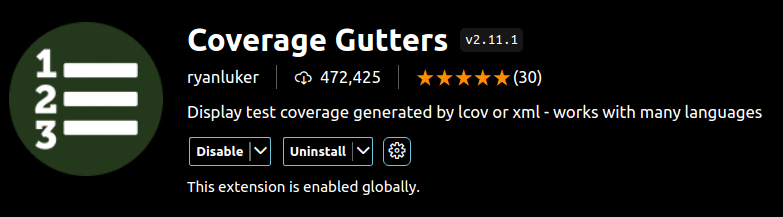

# Rust Code Test Coverage Profile

- this project give a short overview rust code coverage and profile

## My project platform

```bash
cat /etc/os-release
PRETTY_NAME="Ubuntu 22.04.4 LTS"
NAME="Ubuntu"
VERSION_ID="22.04"
VERSION="22.04.4 LTS (Jammy Jellyfish)"
VERSION_CODENAME=jammy
ID=ubuntu
ID_LIKE=debian
HOME_URL="https://www.ubuntu.com/"
SUPPORT_URL="https://help.ubuntu.com/"
BUG_REPORT_URL="https://bugs.launchpad.net/ubuntu/"
PRIVACY_POLICY_URL="https://www.ubuntu.com/legal/terms-and-policies/privacy-policy"
UBUNTU_CODENAME=jammy
```

## My rust version at creation this project

```bash
rustup show
Default host: x86_64-unknown-linux-gnu
rustup home:  /home/trapapa/.rustup

installed toolchains
--------------------

stable-x86_64-unknown-linux-gnu
nightly-x86_64-unknown-linux-gnu (default)

active toolchain
----------------

stable-x86_64-unknown-linux-gnu (directory override for '/home/trapapa/rust_code_test_coverage_profile')
rustc 1.78.0 (9b00956e5 2024-04-29)
```

## I'm use microsoft vscode version

```bash
code --version
1.89.1
dc96b837cf6bb4af9cd736aa3af08cf8279f7685
x64
```

## I'm used this vscode extension special for this project

```bash
code --list-extensions |grep coverage
ryanluker.vscode-coverage-gutters
```

## Project setup

> [!NOTE] > [Project Setup From Here](https://github.com/MathiasStadler/repo_template/blob/main/includes/extract_scripts_from_markdown.md)

&nbsp;

> [!TIP] > [How to set json with comment in MS Video Studio Code](https://github.com/MathiasStadler/repo_template/blob/main/includes/update_rust_add_crates_to_last_version.md)

&nbsp;

> [!NOTE] > [Update rust to latest stable version](https://github.com/MathiasStadler/repo_template/blob/main/includes/update_rust_add_crates_to_last_version.md)

## Instal crates to be used in this project

- I'm use [cargo edit](https://crates.io/crates/cargo-edit), show my [tutorial](https://github.com/MathiasStadler/repo_template/blob/main/includes/update_rust_add_crates_to_last_version.md#install-cargo-edit) for install additional package

```bash
# update all project crates
cargo update
# install cargo-tarpaulin
cargo add cargo-tarpaulin
# /w features
cargo add --features vendored-openssl cargo-tarpaulin
# install flamegraph
cargo add flamegraph
# show version of dependencies and current version vs. akt. version
cargo update --verbose
```

## first testcase

```rust
#!/usr/bin/env bash
export EXAMPLE_SCRIPT_FILE="01_first_testcase.rs"
export EXAMPLE_SCRIPT_DIR="examples/"
cat << EoF > ./$EXAMPLE_SCRIPT_DIR/$EXAMPLE_SCRIPT_FILE
// FROM HERE
// https://github.com/MathiasStadler/repo_template/blob/main/includes/dummy_small_rust_codeblock.md
pub fn main(){

    println!("Hello, world!");
}

#[cfg(test)]
mod test {

    use super::*;

    #[test]
    fn test_main() {
        assert_eq!(main(), ());
    }
}


/*
export FILE_NAME=$EXAMPLE_SCRIPT_FILE
export FILE_DIR_NAME=$EXAMPLE_SCRIPT_DIR
echo "build prg => \$(echo \$FILE_NAME | cut -d . -f 1)";
cargo build --example "\$(echo \$FILE_NAME | cut -d . -f 1)"
echo "run PRG => \$(echo \$FILE_NAME | cut -d . -f 1)";
cargo run --example "\$(echo \$FILE_NAME | cut -d . -f 1)"
echo "";
echo "run TEST => \$(echo \$FILE_NAME | cut -d . -f 1)"
cargo test --example "\$(echo \$FILE_NAME | cut -d . -f 1)"
# cargo test --jobs 4 --example "\$(echo \$FILE_NAME | cut -d . -f 1)"
echo "ReturnCode => \$?"
*/
EoF
```

- [Speed up Rust CI pipelines that use Tarpaulin](https://identeco.de/en/blog/speed-up-rust-ci-pipelines-that-use-tarpaulin/)

## use simple test coverage

> [!TIP]
> a toolchain/build target its own target directory `--target-dir`
> avoid project new compiling for each new test run after small change inside test

```bash
--target-dir target/tarpaulin-target/
```

## I'm ignore all testcase

- add

```bash
--ignore-tests
```

## run all test inside the examples folder

- add command line

```bash
--example
```

- command

```bash
cargo tarpaulin --ignore-tests --target-dir target/tarpaulin-target/ --skip-clean --out Lcov --example
```

- output

```bash
100.00% coverage, 2/2 lines covered, +0.00% change in coverage
```

## I'm use to show coverage inside code via vscode plugin - Coverage Gutters v2.11.1



## second testcase


## profile code /w plugin [flamegraph](https://www.brendangregg.com/flamegraphs.html)

### [install crates flamegraph](#instal-crates-to-be-used-in-this-project)

> [!NOTE]
> HERE CONTINUE

### [install linux-perf](https://github.com/flamegraph-rs/flamegraph)

### check already installed

```bash
apt list --installed linux-tools-`uname -r`
apt list --installed linux-tools-common
apt list --installed linux-tools-generic
```

### if NOT installed

```bash
sudo apt update
sudo apt install linux-tools-common linux-tools-generic linux-tools-`uname -r`
```

### Enabling perf for use by unprivileged users

> [!NOTE]
> To enable perf without running as root,
> you may lower the perf_event_paranoid value in proc
> to an appropriate level for your environment.
> The most permissive value is -1 but may not
> be acceptable for your security needs etc.

```bash
cat /proc/sys/kernel/perf_event_paranoid
sudo echo -1 | sudo tee /proc/sys/kernel/perf_event_paranoid
```

### run [flamegraph](https://github.com/flamegraph-rs/flamegraph)

- by default, `--release` profile is used,

```bash
# --target-dir target/flamegraph-target/
cargo flamegraph
```

- but you can override this:

```bash
cargo flamegraph --dev
```

> [!NOTE]
> [Samples in kernel modules won't be resolved at all.](https://stackoverflow.com/questions/21284906/perf-couldnt-record-kernel-reference-relocation-symbol)
> If some relocation was applied (e.g. kexec) symbols may be misresolved
> even with a suitable vmlinux or kallsyms file.
> Couldn't record kernel reference relocation symbol
> Symbol resolution may be skewed if relocation was used (e.g. kexec).
> Check /proc/kallsyms permission or run as root.
> CHANGE IT to use is for normal user NOT root
>
> ```bash
> # show value
> echo 0 | sudo tee /proc/sys/kernel/kptr_restrict
> # set value to 0
> echo 0 | sudo tee /proc/sys/kernel/kptr_restrict
>```
>

## perf

> [!TIP]
> [Tutorial about perf install/using](http://lost-and-found-narihiro.blogspot.com/2012/06/how-to-install-perf-kernel-performance.html)

## garbage

[FROM HERE](https://stackoverflow.com/questions/66732520/insert-inline-images-in-readme-md)

[FORM HERE](https://blog.peterritchie.com/posts/data-urls-in-markdown)

convert ./test_pictures.png -resize 33% ./out.png
base64 ./out.png
